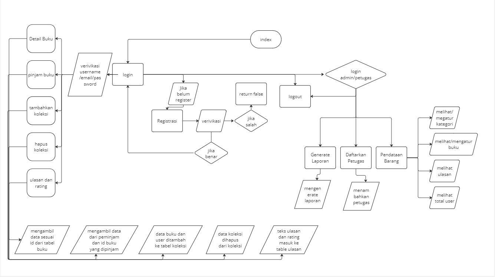

### UKK RPL 2024 | Perpustakaan Bersama – Randy Jeremi Tua Putra Lumban Gaol

**Pendahuluan** 

Perpustaan bersama adalah website sistem perpustakaan digital berbasi web

**Design**

[https://www.figma.com/file/qP7903cZGiPzBZyqR4SXQU/bacayuk?type=design&node-id=0%3A1&mode=design&t=CSAu49NNlYBmsLVW-1](https://www.figma.com/file/3RgW3QomhgrMce91L218Z0/figma_jonathan?type=design&node-id=0-1&mode=design&t=GRcTdG5aRSLL4xXV-0)

**Teknologi yang dipakai** 

Designing UI/UX = Figma  
Front-end = html,css,js  
Back-end = php  

**Diagram alur kerja sistem(flowchart)**

